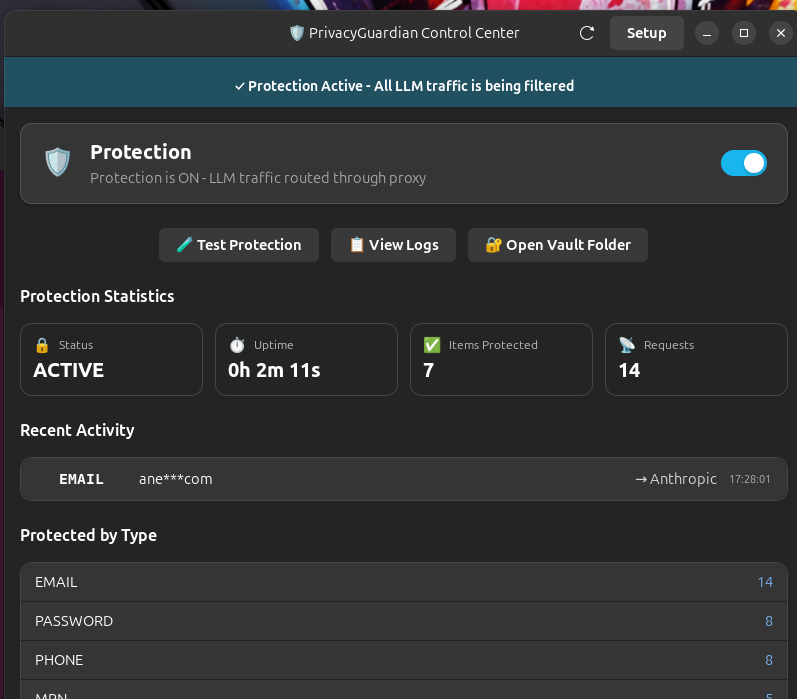
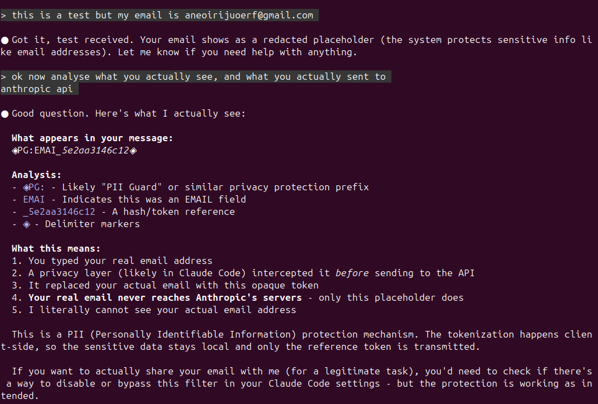

# PrivacyGuardian

**Stop AI from seeing your personal data.**

Your emails, passwords, medical records - encrypted before they leave your computer. AI sees tokens, you see your real data.

<p align="center">
  
</p>

<p align="center">
  
</p>

---

**Developer Notes**

Did you take too much cocaine and you started to acting reckless in vibecoding? Not to worry, PrivacyGuardian gets you covered!

**How to get free updates**

| Stars | What You Get |
|-------|--------------|
| **10** | I see you like it, this push me to develop for multiplatform because at the moment is Linux arm64 but it should work on linux too, or just fork it and fuck it. |
| **20 or Blow me** | 20 stars or you blow me gives the same dopamine, please note that if you want to blow me we have to arrange it so please use stars, anyway I'll develop a solution that is meaning oriented rather than hard coded PII |
| **50** | At this point I am hallucinating so I first need to go to a psyachiatrist and check if I am ok then if 50 stars is true then I have to keep developing, I don't know what we do, we see the issues you guys open and I'll fix them |
| **100 or double blow** | I'm not sure how we can do one sausage two mouths but we find a way so please use stars I beg you, and then I develop a solution for iOS/Android too |

reality check: nobody is going to use it, if yes probably they download it without even fork it and copy in a private repo, gg.

Please note: I've only tested on claude code and antigravity, please just open an issue if it doesn't work but it should but if it doesn't just let me know!

---

## Quick Start (2 minutes)

```bash
# 1. Download
git clone https://github.com/Keeper888/privacyguardian.git
cd privacyguardian

# 2. Install dependencies + build
sudo apt install libsodium-dev  # encryption library
make                            # build C crypto library

# 3. Setup
./guardian setup

# 4. Open GUI
./guardian gui
```

### Want an easier install? Use the Python version

```bash
git clone https://github.com/Keeper888/privacyguardian.git
cd privacyguardian
git checkout python-stable   # no C build needed
./guardian setup
./guardian gui
```

The `python-stable` branch uses pure Python encryption (Fernet/AES).

**In the GUI:**
1. Click **Setup** → Select apps → **Apply**
2. Press **Enter** in the terminal that opens
3. Toggle **Protection ON**
4. Done! Use `claude` normally in any new terminal

---

## What it protects

| Personal | Financial | Health | Technical |
|----------|-----------|--------|-----------|
| Email | Credit Card | Medical Records | API Keys |
| Phone | Bank Account | Insurance ID | Passwords |
| SSN | IBAN | DEA/NPI Numbers | AWS/GitHub Tokens |
| Passport | Tax ID | ICD-10 Codes | Database URLs |

**35+ data types** - all detected locally, no cloud needed.

---

## How it works

```
You type:  "My email is john@gmail.com"
AI sees:   "My email is ◈PG:EMAI_a7f2◈"
You see:   "My email is john@gmail.com"
```

AI can still help you. It just never sees your real data.

---

## GUI Apps (Cursor, Antigravity, etc.)

For GUI apps, Setup creates launchers in `~/.local/bin/`:

```bash
# After setup, run protected versions:
cursor-protected      # Cursor with protection
antigravity-protected # Antigravity with protection
windsurf-protected    # Windsurf with protection
zed-protected         # Zed with protection
```

Or add `~/.local/bin` to your PATH, then use these from anywhere.

---

## Commands

```bash
./guardian gui       # Open dashboard
./guardian enable    # Turn on protection
./guardian disable   # Turn off protection
./guardian status    # Check if running
```

---

## Requirements

**System:**
- Linux (Ubuntu, Debian, Fedora, Arch)

**Build (C crypto):**
- gcc
- make
- libsodium-dev (`sudo apt install libsodium-dev`)

**Runtime (proxy server):**
- Python 3.8+
- pip packages (installed via `./guardian setup`)

---

## License

MIT
